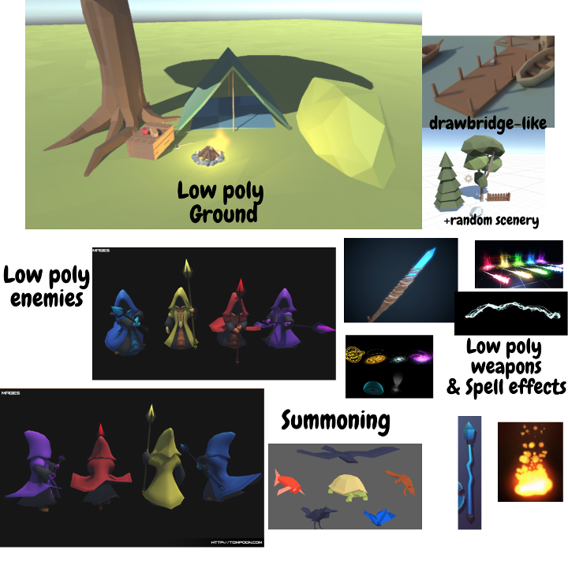
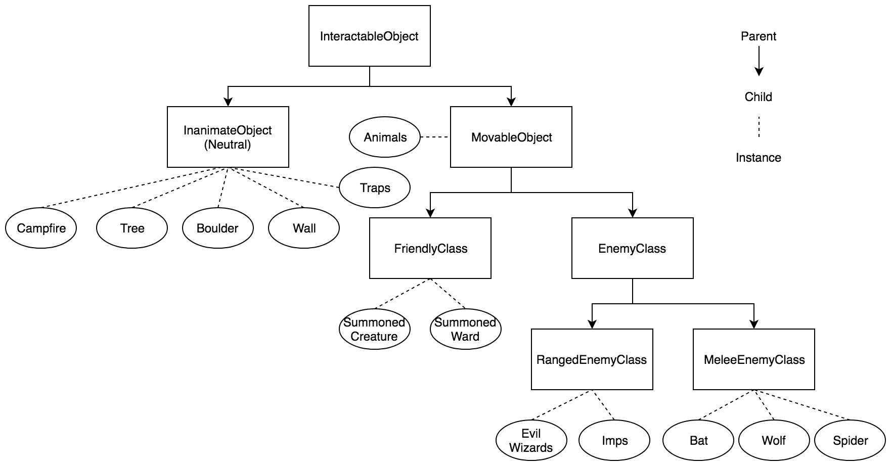

# 1-HP-Wizard

## Introduction
1 HP Wizard is a multi-level, gesture-based, spellcasting game. In this game, the user stands in a stationary location and fends off waves of enemies homing in on their position. 

The player will have to react quickly and strategically since it only takes one hit to defeat them.

## Getting Started (Just Playing)
### Prerequisites
* Oculus (Software)
* Oculus Rift (Hardware)
* Internet connection

### Downloading (55.3MB)

1. Go to the release page by clicking this link

	https://github.com/scott0123/1-HP-Wizard/releases

2. Click the most recent `Build.zip` to download the latest build

3. Unzip the `Build.zip` at the location where you would like to store the game.
	
	Only the Windows version is available at present time.

### Running

Double click `1 HP Wizard.exe` from the folder from the previous step to start the game.

## In-game Pictures

## Getting Started (Development)
### Prerequisites
* Oculus (Software)
* Oculus Rift (Hardware)
* Unity 2018.2.14f1 (for development)

### Downloading (1.77G)

Clone this project.

`cd CLONE_LOCATION` (use cd to navigate to your desired clone location)

`git clone git@github.com:scott0123/1-HP-Wizard.git` or `git clone https://github.com/scott0123/1-HP-Wizard.git`

### Scenes

* `1-HP-Wizard/Assets/Scenes/Menu.unity`
* `1-HP-Wizard/Assets/Scenes/Tutorial.unity`
* `1-HP-Wizard/Assets/Scenes/Level1.unity`
* `1-HP-Wizard/Assets/Scenes/Level2.unity`
* `1-HP-Wizard/Assets/Scenes/Level3.unity`

### Building

`File > Build Settings`

Select your target platform.

`Build`

Select your build location.

## Design

### Theme

### Class Hierarchy

### Spell gestures

### Game Design Document
https://docs.google.com/document/d/1hs4El7qzT2vCHhaPN9zTqvtF0LksF_KemcwoVwB_Los/edit?usp=sharing

## Contact

You may reach me at `1hpwizard@scott-liu.com` to inquire about this project.
